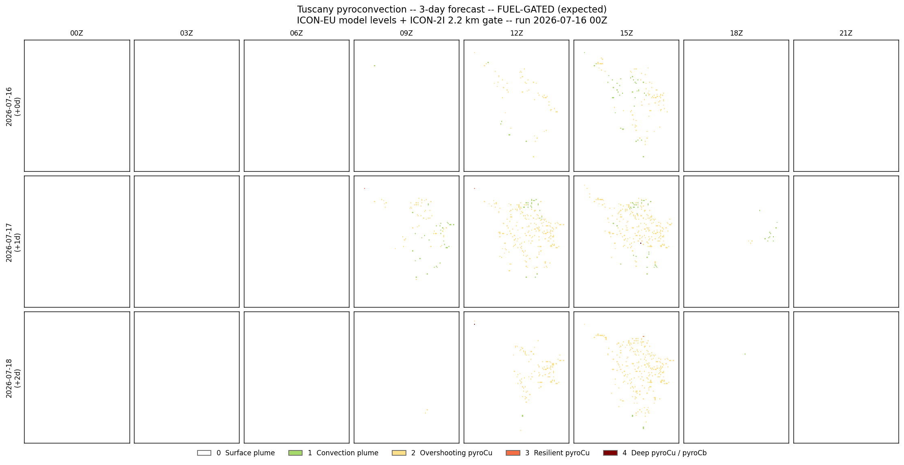
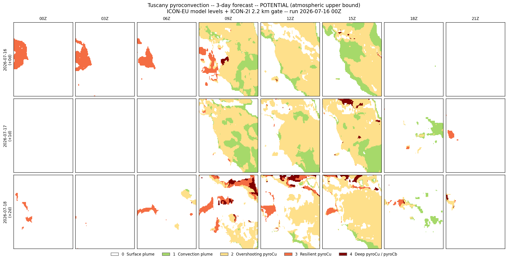

## 3-day forecast

Three valid days from the single 2026-07-16 00Z run (day 0, +1, +2), using the day+1/+2
forecast steps in the same ICON-EU + ICON-2I datasets. Atmosphere from ICON-EU native model
levels (bulk-Richardson ABL, Bolton LCL, measured mixed-layer dtheta/dz, cap gamma-theta,
ABL-top RH, shear); the 10 MW/m fuel gate uses ICON-2I's 2.2 km surface fields on the Tuscany
.lcp fuels. See scripts/validation/README.md for the diagnostic validation (radiosondes + ERA5).

The **fuel-gated** map is the expected product; the **potential** map is the atmospheric
upper bound (assumes a pyroCu-capable fire in every cell). Read class *counts* as indicative.

## Fuel-gated (expected)

{width=100%}

## Potential (atmospheric upper bound)

{width=100%}

## Fuel-gated class distribution -- daytime, % of land cells (11731 land cells)

| Day | Hour | surface | convect | overshoot | resilient | deep |
|:--|:--|--:|--:|--:|--:|--:|
| 2026-07-16 | 09Z | 100.0 | 0.0 | 0.0 | 0.0 | 0.0 |
| 2026-07-16 | 12Z | 99.5 | 0.1 | 0.5 | 0.0 | 0.0 |
| 2026-07-16 | 15Z | 98.9 | 0.3 | 0.7 | 0.0 | 0.0 |
| 2026-07-16 | 18Z | 100.0 | 0.0 | 0.0 | 0.0 | 0.0 |
| 2026-07-17 | 09Z | 99.2 | 0.3 | 0.5 | 0.0 | 0.0 |
| 2026-07-17 | 12Z | 97.9 | 0.2 | 1.9 | 0.0 | 0.0 |
| 2026-07-17 | 15Z | 97.7 | 0.3 | 2.0 | 0.0 | 0.0 |
| 2026-07-17 | 18Z | 99.9 | 0.1 | 0.0 | 0.0 | 0.0 |
| 2026-07-18 | 09Z | 100.0 | 0.0 | 0.0 | 0.0 | 0.0 |
| 2026-07-18 | 12Z | 99.0 | 0.0 | 1.0 | 0.0 | 0.0 |
| 2026-07-18 | 15Z | 97.6 | 0.0 | 2.4 | 0.0 | 0.0 |
| 2026-07-18 | 18Z | 100.0 | 0.0 | 0.0 | 0.0 | 0.0 |

Classes: 0 surface plume, 1 convection plume, 2 overshooting pyroCu, 3 resilient pyroCu,
4 deep pyroCu/pyroCb. Generated by scripts/forecast_3day_tuscany.py.
