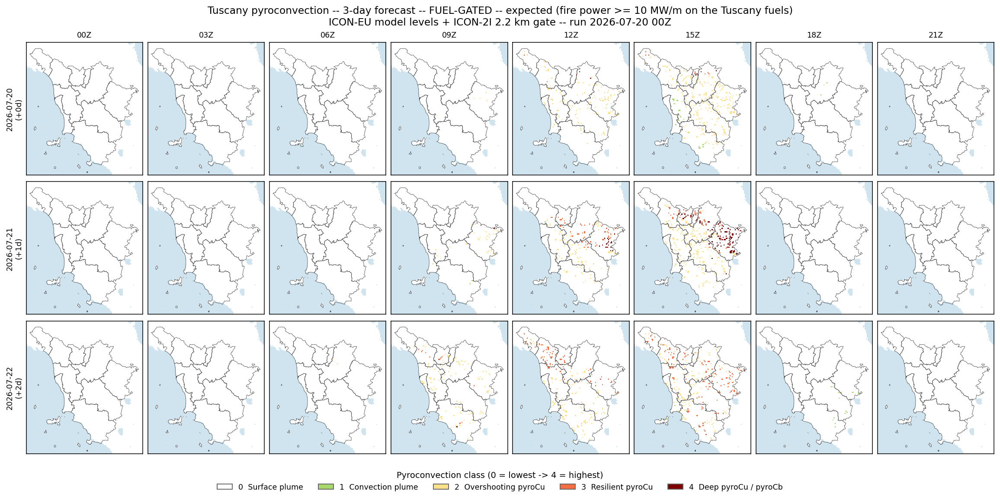
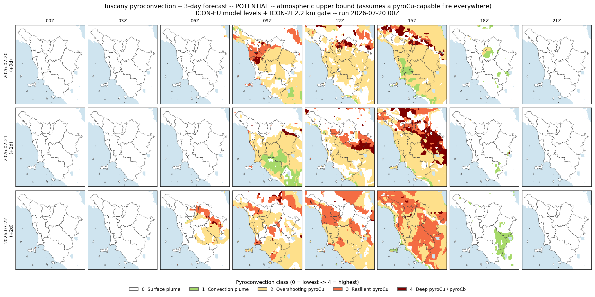

## Overview

Three valid days from the single **2026-07-20 00Z** run (day 0, +1, +2), using the
day+1/+2 forecast steps in the same ICON-EU + ICON-2I datasets. The atmospheric
pyroconvection classification is the hybrid product (ICON-EU native model levels for the
profile -- bulk-Richardson ABL, Bolton LCL, measured mixed-layer dtheta/dz, cap gamma-theta,
ABL-top RH -- with the 10 MW/m fuel gate on ICON-2I's 2.2 km surface fields over the Tuscany
.lcp fuels). Two map series follow; per-province tables summarise both the pyroconvection
potential and the Canadian fire-weather danger for each of the ten Tuscany provinces.

## Fuel-gated pyroconvection (expected)

{width=100%}

## Potential pyroconvection (atmospheric upper bound)

{width=100%}

## Per-province pyroconvection potential metrics

Peak-of-day (09-18Z) statistics per province. *Pot peak* / *Gate peak* are the highest
class reached (0 surface plume -> 4 deep pyroCu/pyroCb); *%pyroCu* is the maximum daytime
areal coverage of class >= 2 (pyrocumulus), *%deep* of class 4. LCL/ABL, ABL depth and the
minimum ABL-top RH are the noon column diagnostics over the province's classified land.
Classes: convection_plume Convection plume, deep_pyrocu_pyrocb Deep pyroCu / pyroCb, overshooting_pyrocu Overshooting pyroCu, resilient_pyrocu Resilient pyroCu, surface_plume Surface plume.

| Province | Day | Pot peak | Pot %pyroCu | Pot %deep | Gate peak | Gate %pyroCu | LCL/ABL | ABL m | RH-top min |
|:--|:--|--:|--:|--:|--:|--:|--:|--:|--:|
| Grosseto | 2026-07-20 | 3 | 62.0 | 0.0 | 2 | 2.7 | 0.88 | 1635.0 | 29.0 |
| Livorno | 2026-07-20 | 4 | 48.0 | 1.5 | 2 | 1.8 | 1.01 | 1052.0 | 30.0 |
| Siena | 2026-07-20 | 2 | 93.5 | 0.0 | 2 | 6.8 | 0.83 | 2528.0 | 27.0 |
| Pisa | 2026-07-20 | 4 | 86.3 | 19.3 | 2 | 3.5 | 1.01 | 1681.0 | 24.0 |
| Arezzo | 2026-07-20 | 4 | 93.2 | 2.6 | 2 | 8.8 | 0.81 | 2661.0 | 23.0 |
| Firenze | 2026-07-20 | 4 | 91.6 | 10.7 | 4 | 6.1 | 0.83 | 2139.0 | 24.0 |
| Prato | 2026-07-20 | 4 | 98.9 | 24.2 | 4 | 9.9 | 0.8 | 2203.0 | 28.0 |
| Pistoia | 2026-07-20 | 4 | 91.6 | 18.1 | 2 | 8.4 | 0.77 | 2160.0 | 23.0 |
| Lucca | 2026-07-20 | 4 | 66.6 | 2.1 | 3 | 3.9 | 0.77 | 1990.0 | 23.0 |
| Massa-Carrara | 2026-07-20 | 4 | 48.8 | 6.2 | 3 | 2.2 | 0.74 | 2029.0 | 23.0 |
| Grosseto | 2026-07-21 | 4 | 77.9 | 0.2 | 2 | 2.8 | 0.94 | 1384.0 | 34.0 |
| Livorno | 2026-07-21 | 4 | 67.1 | 1.2 | 2 | 2.1 | 0.96 | 1035.0 | 38.0 |
| Siena | 2026-07-21 | 4 | 93.4 | 7.2 | 4 | 7.6 | 1.02 | 1882.0 | 38.0 |
| Pisa | 2026-07-21 | 3 | 98.4 | 0.0 | 2 | 6.2 | 0.96 | 1554.0 | 39.0 |
| Arezzo | 2026-07-21 | 4 | 96.5 | 74.6 | 4 | 13.3 | 0.94 | 1865.0 | 38.0 |
| Firenze | 2026-07-21 | 4 | 81.5 | 23.8 | 4 | 8.7 | 0.88 | 1405.0 | 43.0 |
| Prato | 2026-07-21 | 4 | 100.0 | 25.3 | 4 | 14.3 | 0.83 | 1349.0 | 55.0 |
| Pistoia | 2026-07-21 | 4 | 89.1 | 30.7 | 4 | 11.8 | 0.79 | 1527.0 | 51.0 |
| Lucca | 2026-07-21 | 4 | 71.0 | 5.5 | 4 | 6.0 | 0.84 | 1348.0 | 48.0 |
| Massa-Carrara | 2026-07-21 | 4 | 61.8 | 1.6 | 0 | 0.0 | 0.82 | 1187.0 | 57.0 |
| Grosseto | 2026-07-22 | 4 | 94.5 | 0.5 | 4 | 4.9 | 0.87 | 2617.0 | 27.0 |
| Livorno | 2026-07-22 | 4 | 86.7 | 2.7 | 3 | 3.6 | 0.97 | 2014.0 | 38.0 |
| Siena | 2026-07-22 | 4 | 100.0 | 0.6 | 3 | 3.5 | 0.83 | 2597.0 | 32.0 |
| Pisa | 2026-07-22 | 3 | 99.5 | 0.0 | 3 | 6.2 | 0.88 | 2504.0 | 34.0 |
| Arezzo | 2026-07-22 | 4 | 89.6 | 0.5 | 3 | 6.2 | 0.8 | 2211.0 | 42.0 |
| Firenze | 2026-07-22 | 4 | 95.0 | 0.4 | 3 | 5.0 | 0.82 | 2170.0 | 36.0 |
| Prato | 2026-07-22 | 3 | 100.0 | 0.0 | 3 | 6.6 | 0.81 | 2142.0 | 43.0 |
| Pistoia | 2026-07-22 | 4 | 100.0 | 8.8 | 4 | 5.5 | 0.81 | 2133.0 | 40.0 |
| Lucca | 2026-07-22 | 4 | 87.1 | 1.2 | 3 | 9.2 | 0.84 | 2009.0 | 27.0 |
| Massa-Carrara | 2026-07-22 | 4 | 73.0 | 0.6 | 3 | 4.3 | 0.77 | 2119.0 | 33.0 |

## Per-province Canadian FWI System (12Z)

Province-mean of the full FWI System at solar noon on each valid day: the moisture **codes**
FFMC (fine fuels), DMC (duff), DC (deep drought); the **indices** ISI (spread) and BUI
(buildup); and the final **FWI**. The slow DMC/DC drought memory is seeded from
local ERA5 reanalysis 2026-06-05..2026-07-02 (anchor DMC 98 / DC 261) + dry-spell persistence bridge 2026-07-03..2026-07-19 -- **live CDS was unreachable at run time**, giving a run-day antecedent state of **FFMC 88.5 / DMC
144.9 / DC 416.0**; that state is then carried forward through the three
forecast days on the run's own 12Z weather. Forecast rain is taken as 0 (dry-spell
assumption); a wetting event would lower FFMC/DMC and the indices. Danger classes follow the
EFFIS FWI scale.

| Province | Day | FFMC | DMC | DC | ISI | BUI | FWI | Danger |
|:--|:--|--:|--:|--:|--:|--:|--:|:--|
| Grosseto | 2026-07-20 | 89.7 | 148.9 | 425.7 | 8.8 | 158.9 | 34.0 | high |
| Livorno | 2026-07-20 | 88.6 | 148.0 | 425.4 | 6.8 | 158.3 | 28.6 | high |
| Siena | 2026-07-20 | 91.3 | 149.8 | 425.8 | 10.7 | 159.4 | 38.7 | very high |
| Pisa | 2026-07-20 | 89.8 | 149.0 | 425.6 | 9.1 | 158.9 | 35.0 | high |
| Arezzo | 2026-07-20 | 90.9 | 149.4 | 425.4 | 10.1 | 159.1 | 37.1 | high |
| Firenze | 2026-07-20 | 89.8 | 148.9 | 425.3 | 7.1 | 158.8 | 29.6 | high |
| Prato | 2026-07-20 | 89.7 | 148.8 | 425.3 | 6.4 | 158.8 | 27.4 | high |
| Pistoia | 2026-07-20 | 89.1 | 148.4 | 425.0 | 5.9 | 158.5 | 26.2 | high |
| Lucca | 2026-07-20 | 89.1 | 148.4 | 425.0 | 7.0 | 158.5 | 29.3 | high |
| Massa-Carrara | 2026-07-20 | 88.6 | 148.1 | 424.9 | 6.7 | 158.2 | 28.4 | high |
| Grosseto | 2026-07-21 | 89.9 | 152.8 | 435.3 | 10.3 | 162.8 | 37.9 | high |
| Livorno | 2026-07-21 | 88.8 | 151.4 | 434.8 | 6.8 | 161.9 | 28.8 | high |
| Siena | 2026-07-21 | 92.6 | 155.2 | 435.7 | 15.7 | 164.2 | 49.6 | very high |
| Pisa | 2026-07-21 | 91.1 | 153.7 | 435.2 | 12.1 | 163.2 | 42.1 | very high |
| Arezzo | 2026-07-21 | 92.5 | 154.8 | 435.1 | 14.1 | 163.8 | 46.5 | very high |
| Firenze | 2026-07-21 | 91.3 | 153.6 | 434.9 | 11.8 | 163.2 | 41.4 | very high |
| Prato | 2026-07-21 | 89.9 | 152.9 | 434.6 | 9.0 | 162.7 | 34.8 | high |
| Pistoia | 2026-07-21 | 89.5 | 152.2 | 434.2 | 9.1 | 162.2 | 34.9 | high |
| Lucca | 2026-07-21 | 89.5 | 152.0 | 434.1 | 8.4 | 162.1 | 33.1 | high |
| Massa-Carrara | 2026-07-21 | 88.5 | 151.1 | 433.7 | 6.9 | 161.5 | 28.9 | high |
| Grosseto | 2026-07-22 | 93.1 | 158.4 | 444.9 | 14.1 | 167.6 | 46.5 | very high |
| Livorno | 2026-07-22 | 92.4 | 156.7 | 444.4 | 12.1 | 166.5 | 42.2 | very high |
| Siena | 2026-07-22 | 93.1 | 160.4 | 445.0 | 12.0 | 168.7 | 42.2 | very high |
| Pisa | 2026-07-22 | 93.0 | 159.1 | 444.8 | 11.2 | 168.0 | 40.5 | very high |
| Arezzo | 2026-07-22 | 92.1 | 159.0 | 443.8 | 11.8 | 167.8 | 41.8 | very high |
| Firenze | 2026-07-22 | 91.5 | 158.0 | 443.8 | 11.5 | 167.2 | 40.7 | very high |
| Prato | 2026-07-22 | 90.9 | 157.1 | 443.4 | 10.8 | 166.6 | 39.0 | very high |
| Pistoia | 2026-07-22 | 90.3 | 156.1 | 442.8 | 9.7 | 166.0 | 36.2 | high |
| Lucca | 2026-07-22 | 90.6 | 156.2 | 442.8 | 9.0 | 166.0 | 34.6 | high |
| Massa-Carrara | 2026-07-22 | 89.6 | 154.8 | 442.2 | 7.6 | 165.1 | 30.8 | high |

Generated by scripts/forecast_3day_province_report.py. Pyroconvection: pyflam.pyroconvection_type
(hybrid). FWI: pyflam.fwi + pyflam.fire_weather_history (ERA5/SIR spin-up). CSV tables accompany
this report in the same folder.
