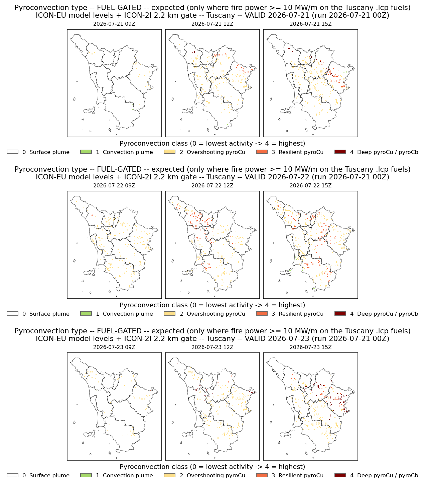
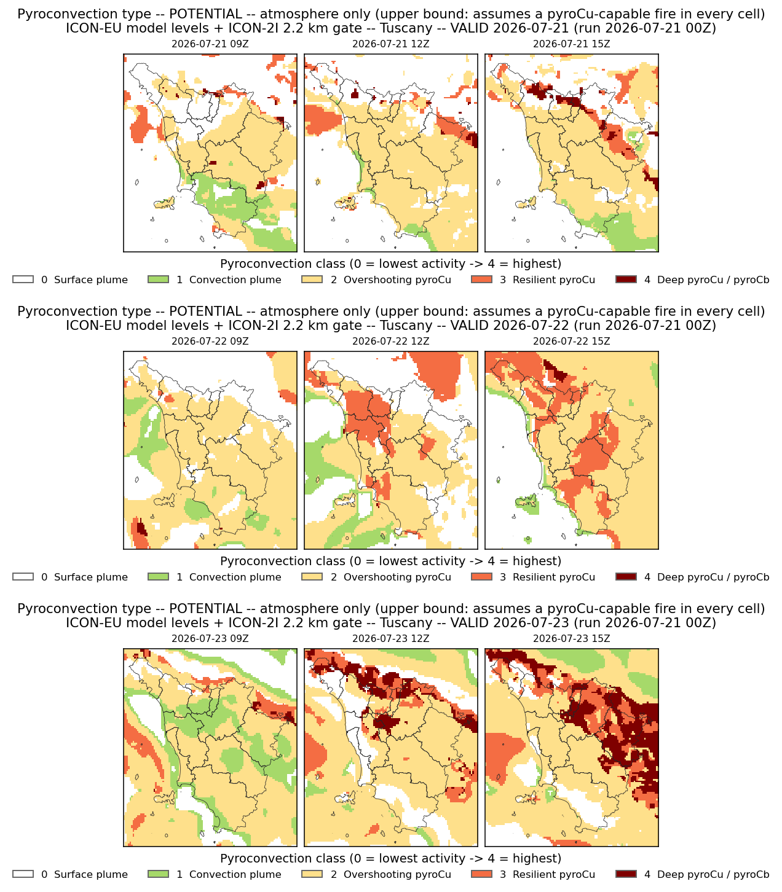
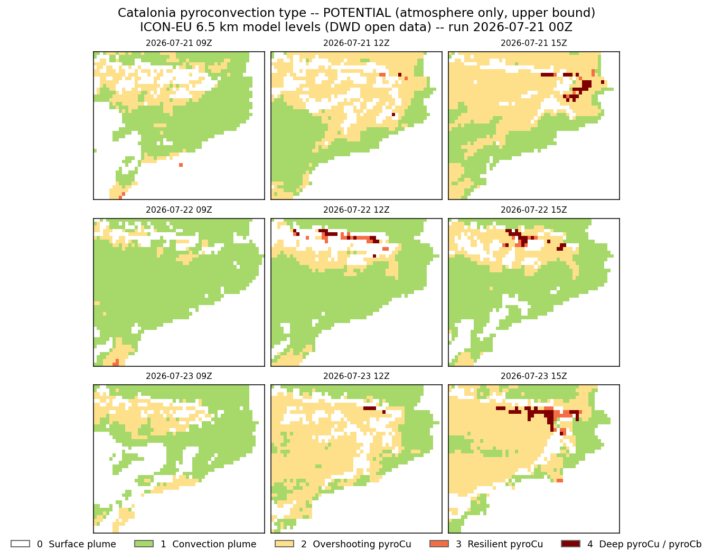

# Pyroconvection type -- 3-day forecast (valid 2026-07-21 .. 2026-07-23)

Run 2026-07-21 00Z. Daytime hours 09/12/15 Z per day. Classifier:
`pyflam.pyroconvection_type` (bulk-Richardson ABL, Bolton LCL, mixed-layer
dtheta/dz, cap gamma-theta, ABL-top RH; no surface CAPE), plus the new
dry-pyrocloud fireABL/decoupling diagnostic.

## Tuscany -- FUEL-GATED (hybrid ICON-EU + ICON-2I 2.2 km gate)

Expected: classed only where fire power >= 10 MW/m on the real .lcp fuels.

{width=85%}

## Tuscany -- POTENTIAL (atmosphere only, upper bound)

{width=85%}

## Catalonia -- POTENTIAL (ICON-EU 6.5 km only)

Catalonia is outside the ICON-2I 2.2 km domain and has no Catalan .lcp fuel, so
only the ICON-EU-native potential (upper-bound) map is produced -- no fuel gate.

{width=95%}

## Class scale

| 0 white | 1 green | 2 yellow | 3 orange | 4 dark red |
|:--:|:--:|:--:|:--:|:--:|
| Surface plume | Convection plume | Overshooting pyroCu | Resilient pyroCu | Deep pyroCu / pyroCb |

Generated by pyflam (feat/dry-pyroconvection-fireabl). Tuscany hybrid via
tests/pyroconv_daily.py; Catalonia via scripts/catalunya_iconeu_3day.py.
